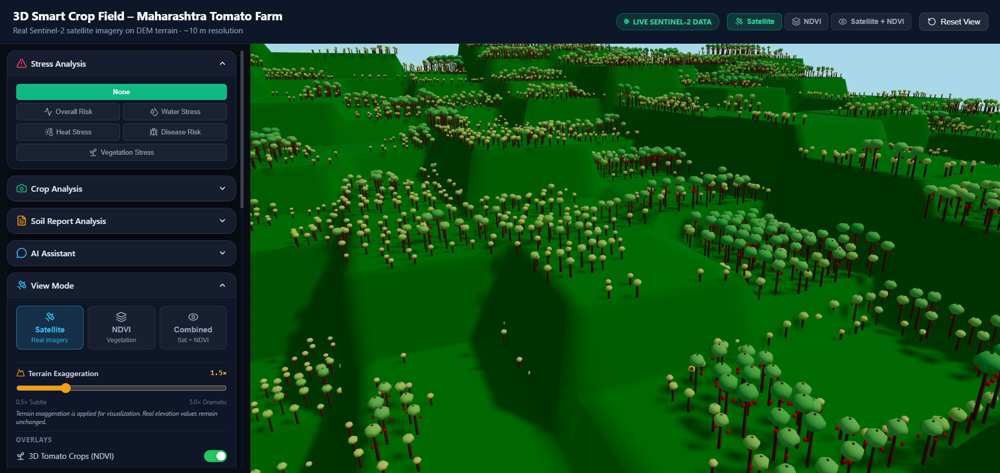
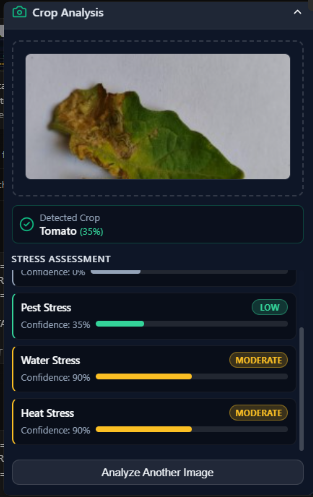
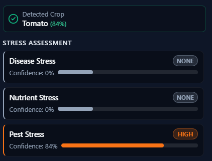

<div align="center">
  <h1>🌾 3D Smart Crop Field & AI Advisory Platform</h1>
  <p><strong>A Next-Generation Agricultural Intelligence System combining Satellite GIS, Deep Learning, and 3D Visualization.</strong></p>

  
</div>

---

## 🏆 Hackathon Details
- **Competition:** Hackmatrix by PCCOE College
- **Team Name:** God's Plan
- **Team Members:** Soham, Aniket, Pratyusha, Anjali

## 📁 Resources & Links
- **Google Drive (Datasets & Video Explanation):** [Access Here](https://drive.google.com/drive/folders/1sHIZos_T6dtPiKoPvWdgn3tCfAkX-Um0?usp=sharing)

---

## 📖 Executive Summary
The **3D Smart Crop Field & AI Advisory Platform** is a production-grade, multi-layered agricultural intelligence system built to empower farmers and agronomists with high-precision insights. 

Instead of relying on single-axis diagnostics, our platform integrates **real-time 3D topographical visualization (DEM)**, **multispectral satellite imagery (Sentinel-2 NDVI)**, and **Deep Learning-based leaf/soil analysis** into a single cohesive dashboard.

### Core Pillars of the Platform:
1. **PART A (Macro-Level Field Analysis):** A fully interactive 3D map powered by CesiumJS. It renders a 10m grid mapping of a farm, overlaying Digital Elevation Models (DEM) and live NDVI (Normalized Difference Vegetation Index) calculations derived from Sentinel-2 satellite data.
2. **PART B (Micro-Level Crop Analysis):** A multi-factor Machine Learning computer vision pipeline. Farmers can upload photos of crop leaves and physical soil reports, which are processed by specialized deep neural networks (EfficientNet-B0) to assess 5 dimensions of stress: Disease, Nutrient, Pest, Water, and Heat.
3. **PART C (Conversational AI - Architectural Layer):** An integration with Groq's Llama-3 models to act as a conversational agricultural assistant that synthesizes field data, image predictions, and soil context to give human-readable advice.

---

## 🧠 Complete System Architecture

```mermaid
graph TD
    %% Frontend Layer
    subgraph Frontend [React + Vite + CesiumJS Dashboard]
        UI1[3D Smart Field Map]
        UI2[Cell Inspector]
        UI3[Crop Image Upload]
        UI4[Soil Report Upload]
        UI5[AI Assistant Chat]
    end

    %% Backend API Layer
    subgraph Backend [FastAPI Server]
        R1[/api/terrain]
        R2[/api/grid]
        R3[/api/ml/analyze-image]
        R4[/api/ml/analyze-soil]
        R5[/api/assistant/chat]
    end

    %% GIS & Macro Engine
    subgraph GIS [Part A: GIS & Macro Engine]
        DEM[(Digital Elevation Model .tif)]
        Sat[(Sentinel-2 Imagery)]
        NDVI[NDVI Calculator]
        Grid[10m Resolution Grid Generator]
    end

    %% ML & Micro Engine
    subgraph ML [Part B: ML & Vision Engine]
        DL1[EfficientNet-B0 Tomato Model]
        DL2[Custom CNN Maize Model]
        CV[Visual Color Analysis Engine]
        OCR[Soil Report OCR Parser]
    end

    %% AI Layer
    subgraph AI [Part C: Generative AI]
        LLM[Groq Llama-3 API]
        PromptGen[Context Synthesizer]
    end

    %% Data Flow
    UI1 <--> R1
    UI2 <--> R2
    UI3 --> R3
    UI4 --> R4
    UI5 <--> R5

    R1 --> DEM
    R2 --> NDVI
    NDVI --> Sat
    NDVI --> Grid

    R3 --> DL1
    R3 --> DL2
    R3 --> CV
    R4 --> OCR

    R5 --> PromptGen
    PromptGen --> LLM
    Grid --> PromptGen
    DL1 --> PromptGen
    OCR --> PromptGen
```

---

## 🌍 PART A: 3D Smart Crop Field (Macro Analysis)

We render the farmer's physical field in absolute 3D utilizing **CesiumJS**.

### 📡 Sentinel-2 & NDVI Integration
The platform computes the **Normalized Difference Vegetation Index (NDVI)** using the Near-Infrared (NIR) and Red spectral bands from raw Sentinel-2 satellite tiles. 
- **Healthy Vegetation:** Highly reflective in NIR, absorbs Red (High NDVI).
- **Stressed Vegetation:** Drops in NIR reflectance (Low NDVI).
We project this data across a **10x10 meter grid**, allowing farmers to identify precise spatial patches of drought, disease spread, or poor irrigation without walking the entire farm.

### ⛰️ Digital Elevation Model (DEM)
Water runoff and nutrient pooling are heavily dictated by farm topography. By rendering a `.tif` based DEM, the 3D map accurately reflects elevation changes, allowing agronomists to correlate low NDVI patches with topographical sinks (flooding risk) or peaks (water scarcity/heat stress).

---

## 🔬 PART B: ML-Powered Crop & Soil Analysis (Micro Analysis)

When satellite data shows a stressed patch, the farmer can walk to that 10m grid cell and upload a photo of the affected plant leaf. 

<div align="center" style="display: flex; gap: 10px; justify-content: center;">
  
  
</div>

### 🥬 Deep Learning Inference Pipeline
We deployed a **Two-Phase Transfer Learning** approach on an **EfficientNet-B0** backbone for Tomato crops (8-classes), and a lightweight **Custom CNN** for Maize crops (3-classes). 
- **Test Accuracy (Tomato):** 73.97% 
- **Test Accuracy (Maize):** 83.08%

### 🖐️ The 5-Factor Stress Assessment Framework
Unlike basic single-label image classifiers, our system processes the image through two parallel engines (Deep Learning + Statistical Computer Vision) to generate a comprehensive 5-factor stress report:

1. **Disease Stress (DL):** Aggregates probabilities of pathogens (e.g., Early Blight, Late Blight, Spotted Wilt Virus).
2. **Nutrient Stress (DL):** Aggregates probabilities of chlorosis patterns (Nitrogen, Magnesium, Potassium deficiencies).
3. **Pest Stress (DL):** Detects physical tunneling/damage (e.g., Leaf Miners).
4. **Water Stress (CV):** Uses a deterministic Computer Vision engine to analyze Green Dominance Ratios and Brown Discoloration Indices to detect wilting/desiccation in the physical pixels.
5. **Heat Stress (CV):** Analyzes Red-to-Green ratios and Yellow Discoloration Indices to detect sun-bleaching and thermal scorch.

*(Note: Model weights `*.pth` and `datasets/` are stored on the provided Google Drive link and git-ignored here to maintain repository speed and limits).*

---

## 🤖 PART C: Multimodal Groq AI Assistant

The backend is configured to seamlessly interface with **Groq's Llama-3** models. 
The system acts as a Context Synthesizer: It takes the Macro Data (Grid NDVI, weather), the Micro Data (Uploaded Leaf Image ML Predictions), and Soil Chemistry (Parsed from uploaded soil test OCR), and prompts the LLM. 
The LLM acts as an expert Agronomist, talking to the farmer in plain language, explaining *why* a patch of their farm is failing and exactly what fertilizer or irrigation schedule to apply.

---

## 💻 Technology Stack

### Frontend
- **React.js 18 + Vite** (High-performance UI)
- **TypeScript** (Strict type safety)
- **CesiumJS** (3D Geospatial Rendering)
- **Tailwind CSS / Custom CSS** (Responsive Dashboard UI)

### Backend
- **Python 3.11** 
- **FastAPI** (High-throughput async API framework)
- **Uvicorn** (ASGI Web Server)

### Machine Learning & GIS
- **PyTorch & TorchVision** (Model Training & Inference)
- **Pillow (PIL) & NumPy** (Computer Vision & Array manipulation)
- **scikit-learn** (Metrics evaluation)
- **Rasterio / GDAL** (TIFF / DEM / Satellite Imagery processing)

---

## ⚙️ Local Setup & Installation

### 1. Clone the Repository
```bash
git clone https://github.com/Aniket8983-arch/pccoehackathon.git
cd pccoehackathon
```

### 2. Backend Setup
```bash
# Install Python dependencies
pip install -r requirements.txt

# Download model weights from the provided Google Drive link
# Place them in: pccoe_hackathon/ml/models/

# Start the FastAPI server
python backend/server.py
# Server runs at http://localhost:8000
```

### 3. Frontend Setup
```bash
cd frontend

# Install Node dependencies
npm install

# Build for production
npx vite build
```
*Note: The FastAPI backend automatically mounts and serves the static Vite build on `http://localhost:8000/`. No need to run a separate frontend dev server in production.*

---

<div align="center">
  <i>Built with ❤️ by team <b>God's Plan</b> for Hackmatrix, PCCOE.</i>
</div>
